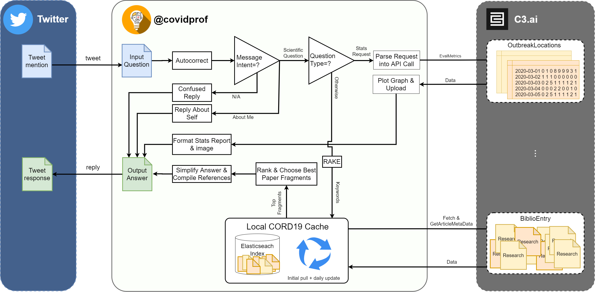
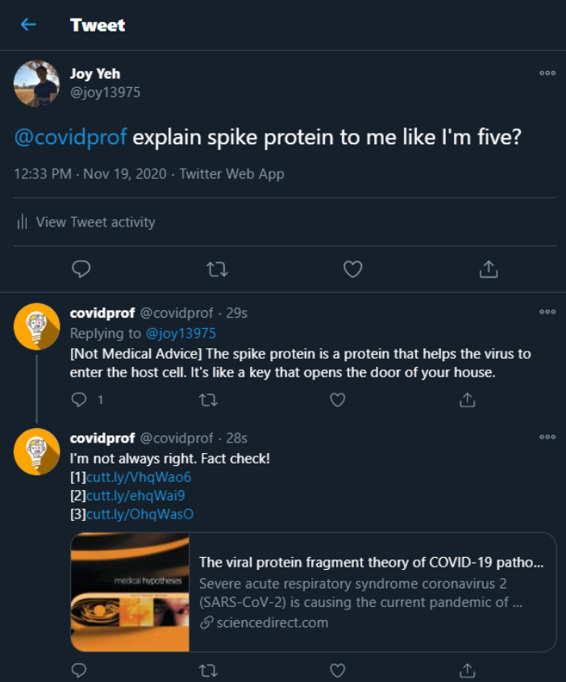

# covidprof

This is a C3.ai Grand Challenge project.

Our aim is to build a chatbot that can teach non-exports about COVID-19 research by explaining latest publicly avilable research in layman's terms.

`covidprof` currently uses Twitter as frontend, and uses C3.ai's data lake as the main source of COVID-19 related research data.

It is highly configurable, and has an architecture that allows it to be run on multiple computers to better suit different hardware requirements of each components.

Overall system + data flow diagram:

# If you are a C3.ai judge

The easiest and quickest way for you to try out `covidprof` is to head to Twitter and ask [@covidprof](https://twitter.com/covidprof) something!

Example:

Because this app's architecture requires many moving parts and API keys prepared for several different services, running this setup as-is from a different environment may take some time to setup. This project is easy to set up, but the preparation takes considerable time due to the following steps required to run the app successfully:

1. Apply for GPT-3 beta access (>2wks?) <- manual and luck-based
2. Build an Elasticsearch index from BiblioEntry data (~2hr) <- automated
3. Download a large BERT model (~15m) <- automated
4. Setup Twitter developer account (~10m) <- manual
5. Setup cutt.ly URL shortening API account (~10m) <- manual
6. Acquire a GPU instance to run the BERT model on (?)

But if you insist, we are happy to get you set up.
Please contact [Joy Yeh](joyyeh.tw@gmail.com).

# Setup
Follow the following steps once you have obtained your OpenAI GPT-3 API keys, Twitter API keys, and cutt.ly API key. For fast response times, we recommend using a GPU instance for the BERT model.
1. Install pip packages 
`pip install -r requirements.txt`
2. Install Elasticsearch on your platform [guide](https://www.elastic.co/guide/en/elasticsearch/reference/current/install-elasticsearch.html).
3. For each `config/*.json.example` file, copy it into `config` without and remove the `.example` suffix.
4. Replace your API keys in 
 - `config/gpt3adapter.json`
 - `config/twittersecret.json`
 - `config/webadapter.json`
5. Build the CORD-19 search index using Elasticsearch
 - `python src/build_index.py download` - this downloads C3.ai CORD-19 data (can take a while)
 - `python src/build_index.py init` - this passes the CORD-19 papers into Elasticsearch (can take a while)
 - `python src/build_index.py add <filename>` - this allows one to add a single JSON document into the index if needed.

 # First Time Run
 1. - If you got a GPU instance, run the excerpt extraction server on it:
 `python src/excerpt_server.py`
       - Note that this instance does _not_ need to be the same as the Elasticsearch instance.
       - The first run will also download the default 
 `bert-large-uncased-whole-word-masking-finetuned-squad` model
    - If you have a CPU instance, `python src/excerpt_server.py accelerator=cpu`
 2. After #1 in finished, based on
    - If your `excerpt_server` instance is different from your Elasticsearch instance, then make sure to update IP of `excerpts_conn_str` in `config/webadapter.json`.
    - If your `excerpt_server` instance is the same as your Elasticsearch instance, then config doesn't need to be updated.
 3. Run the main server! 
 `python src/professor.py`